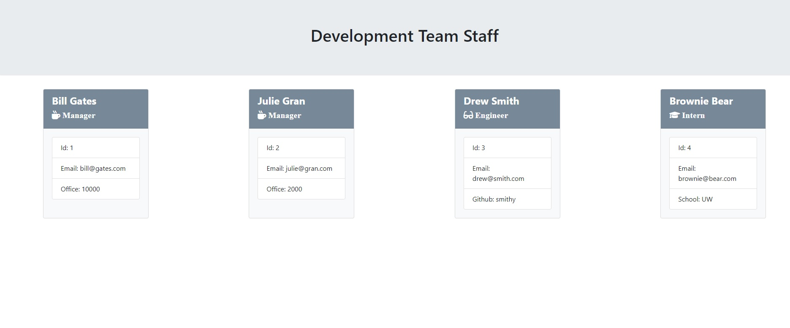

# Teamprofilegenerator

 This is Node CLI  app that takes in information about employees and generates an HTML webpage that displays summaries for each person.
 
 * Use the [Inquirer npm package](https://github.com/SBoudrias/Inquirer.js/) to prompt the user for their email, id, and specific information based on their role with the company. For instance, an intern may provide their school, whereas an engineer may provide their GitHub username.

* Your app will run as a Node CLI to gather information about each employee.
In the `Develop` folder, there is a `package.json`, so make sure to `npm install`.

The dependencies are, [jest](https://jestjs.io/) for running the provided tests, and [inquirer](https://www.npmjs.com/package/inquirer) for collecting input from the user.

The "team" consists of manager, engineers, and interns. Each is represented by the parent class Employee from which each type of role is an extended class from Employee.
An HTML file is generated from the answers given in command line prompts.

